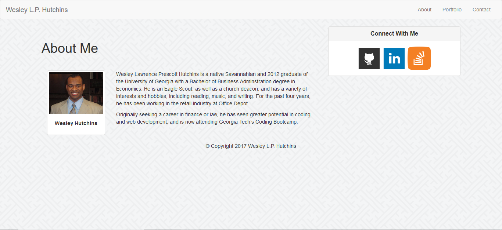
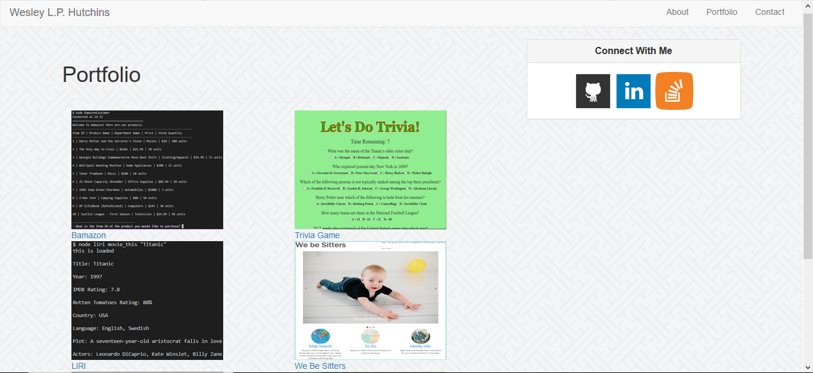
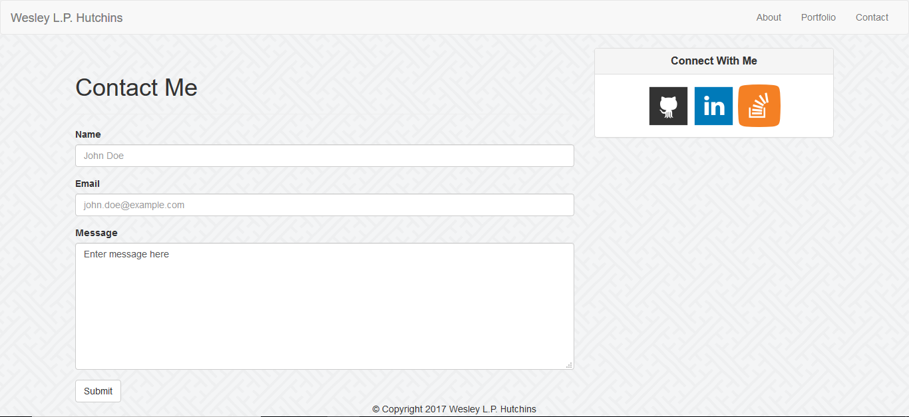

# Bootstrap-Portfolio

My second portfolio site, which demonstrates my first use of Bootstrap. It provides an introduction page with a short biography about myself, a contact page, and a page which features my portfolio of projects.

## How to Use

User opens application via the GitHub Pages [link](https://wespres1990.github.io/Bootstrap-Portfolio/index.html) to the homepage to view my short biography, and can access the contact and portfolio pages by clicking on the links to those pages at the top right-hand side of the main page. The portfolio page provides access to the GitHub repositories of my projects by clicking on the pictures and/or names of said projects.

Additionally, the site provides links to my social media profiles on LinkedIn, GitHub, and Stack Overflow.

### Technologies Used

Languages - HTML5, CSS4, Bootstrap

Text Editor - VS Studio

## Preview

### Homepage
- - - -

### Portfolio
- - - -

### Contact
- - - -

## Contributing

Open to suggestions for improvement!

## Future Development

* Continue to develop (as projects are added)
* Making it more responsive
* Adding more (and sophisticated) styling

## Authors

* **Wesley Hutchins** - [Github](https://github.com/WesPres1990)